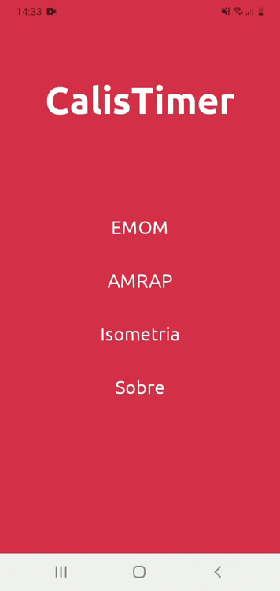

# CalisTimer

  App for help with calisthenics training

  <!-- iOS -->
    
  
  <!-- Android -->
  
  <!-- Web -->
  

## Preview

  
  

    
   
    
   

## 🚀 How to use

- You need have `yarn` or `npm` installed
- Clone or Download this repo using the button <b>CODE</b> at the top this page  
- Install packages with `yarn` or `npm install`.
  - If you have native iOS code run `npx pod-install`
- Run `yarn start` to start the bundler.
- Open the project in a React runtime to try it:
  - iOS: [Client iOS](https://itunes.apple.com/app/apple-store/id982107779)
  - Android: [Client Android](https://play.google.com/store/apps/details?id=host.exp.exponent&referrer=blankexample)
  - Web: Any web browser

## 📝 Features

- ⚛️ **Node Js** — A web framework for Node Js

## License

This project is licensed under the MIT License - see the [LICENSE](https://opensource.org/licenses/MIT) page for details.
